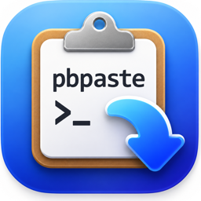
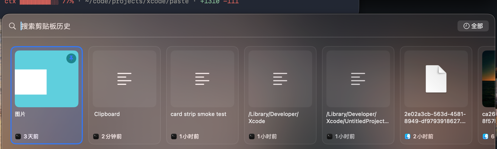

<p align="center">
  
</p>

<h1 align="center">pbpaste</h1>

<p align="center">macOS 菜单栏剪贴板历史管理器 · 原生 SwiftUI + SwiftData · 无第三方依赖</p>



干净房间（clean-room）实现：不包含任何商业剪贴板管理器的代码或素材。

## 功能

- **自动记录**：文本、图片、文件复制历史；相同内容自动去重并移到最前。
- **全局热键**：默认 `⇧⌘V` 呼出面板，可在设置中重新录制任意组合键。
- **非激活浮动面板**：不打断当前应用焦点
  - `←` `→` 选择 · `↩` 粘贴 · `⌥↩` 纯文本粘贴 · `⎋` 关闭
  - 搜索过滤 + 时间筛选（全部 / 最近 1 小时 / 今天 / 最近 7 天）
- **点击即粘贴**：点击卡片直接向当前应用模拟 `⌘V`（需辅助功能授权；未授权时自动降级为「仅复制到剪贴板」并给出提示）。
- **置顶**：置顶项不参与任何自动清理。
- **保留时长**：永久 / 1 天 / 7 天 / 30 天。
- **iCloud 存储**：可把历史存入 iCloud 云盘；容器不可用时自动回退本机。
- **隐私过滤**：忽略密码管理器等敏感内容（ConcealedType、TransientType、AutoGeneratedType、1Password）。
- **中英双语**：界面跟随系统语言（简体中文 / English）。
- **登录时启动**（可选）。

## 系统要求

macOS 27.0 或更高版本。

## 构建与运行

需要完整 Xcode（若 `xcode-select` 指向 Command Line Tools，用 `DEVELOPER_DIR` 前缀）：

```sh
DEVELOPER_DIR=/Applications/Xcode.app/Contents/Developer \
  xcodebuild -project paste.xcodeproj -scheme paste \
  -configuration Release -destination 'platform=macOS' \
  -derivedDataPath build build

open build/Build/Products/Release/pbpaste.app
```

打包 DMG（可选）：

```sh
mkdir -p dist/dmg_root
cp -R build/Build/Products/Release/pbpaste.app dist/dmg_root/
ln -s /Applications dist/dmg_root/Applications
hdiutil create -volname "pbpaste 2.0" -srcfolder dist/dmg_root -ov -format UDZO dist/pbpaste-2.0.dmg
```

## 使用

1. 启动后应用常驻菜单栏（无 Dock 图标），自动开始记录剪贴板。
2. 按 `⇧⌘V` 呼出面板，或点击菜单栏图标选择「显示剪贴板历史」。
3. 首次点击历史卡片时，系统会提示为 pbpaste 授权「辅助功能」（用于模拟 `⌘V` 直接粘贴）。不授权也能用：点击卡片只复制到剪贴板，手动 `⌘V` 粘贴。
4. 菜单栏图标 → 「设置…」可修改热键、保留时长与 iCloud 存储。

## 数据与隐私

- 历史数据保存在 `~/Library/Application Support/pbpaste/`；开启 iCloud 后存入你自己 iCloud 云盘的 pbpaste 目录。
- 图片以文件形式存放在同目录下的 `.clips_SUPPORT/`。
- 应用不联网、不收集任何数据，剪贴板内容只存在本机或你的个人 iCloud。
- 显示文件类条目的缩略图时会读取对应文件，系统可能按需询问文件夹访问权限（如「下载」文件夹）。

## 已知说明

- 本地构建为 ad-hoc 签名：**每次重新构建后**，系统里的「辅助功能」授权会失效，需在系统设置中重新授权（菜单栏 → 「辅助功能权限」可直达）。不更换 app 文件则授权长期有效。
- 应用未启用 App Sandbox（向其他应用发送 `⌘V` 事件所需）。
- DMG 分发的构建未经公证，在其他 Mac 上首次打开需右键 → 打开。

## 项目结构

| 路径 | 内容 |
| --- | --- |
| `paste/AppDelegate.swift` | 组合根：状态栏菜单、偏好项、启动流程 |
| `paste/Model/` | SwiftData 模型（ClipItem）与剪贴板读取 |
| `paste/Store/` | 存储位置解析（本机 / iCloud）、保留时长清理 |
| `paste/Clipboard/` | 剪贴板监听、写入、模拟粘贴 |
| `paste/Hotkey/` | 全局热键（Carbon）与组合键模型 |
| `paste/Panel/` | 浮动面板（NSPanel）与几何参数 |
| `paste/UI/` | 卡片、卡条、时间筛选视图 |
| `paste/Settings/` | 设置窗口与快捷键录制 |
| `paste/Localizable.xcstrings` | 字符串目录（英文源 + 简体中文） |
